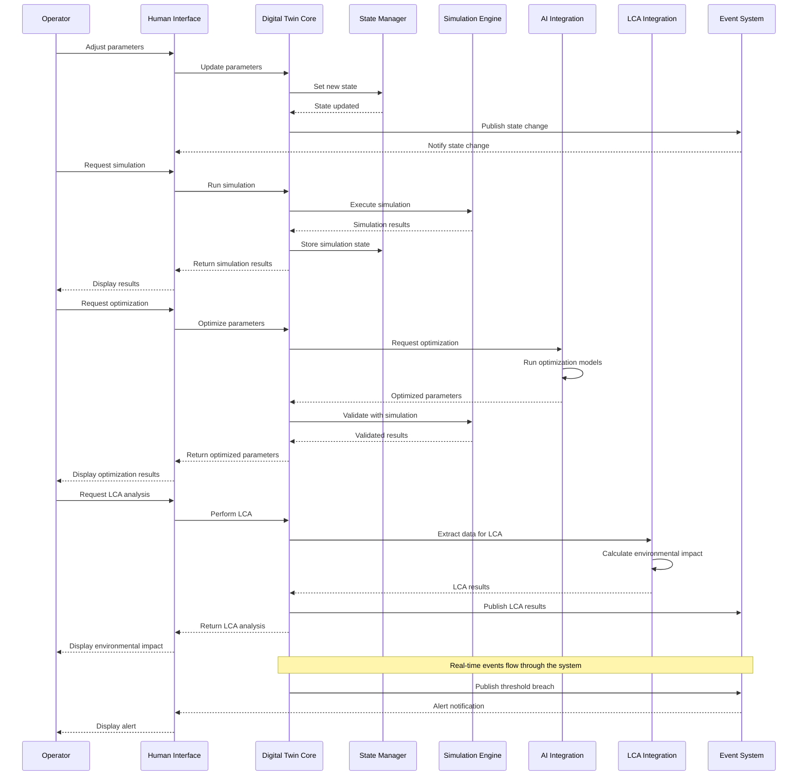

# Digital Twin Integration Guide

## 1. Introduction

This guide provides comprehensive instructions for integrating the CIRCMAN5.0 Digital Twin with other systems. It covers integration patterns, APIs, and best practices for creating cohesive connections between the digital twin and external components.

## 2. Integration Architecture Overview

The CIRCMAN5.0 Digital Twin is designed for seamless integration with multiple systems through a standardized architecture:

```
                          ┌─────────────────┐
                          │                 │
                          │  Digital Twin   │
                          │                 │
                          └───────┬─────────┘
                                  │
                 ┌────────────────┼────────────────┐
                 │                │                │
        ┌────────▼───────┐ ┌──────▼─────┐ ┌────────▼───────┐
        │                │ │            │ │                │
        │  AI Systems    │ │ LCA Systems│ │ Human Interface│
        │                │ │            │ │                │
        └────────────────┘ └────────────┘ └────────────────┘
```

## 3. Integration Patterns

### 3.1 Adapter Pattern

The system implements the adapter pattern for standardized integration:

```python
# Example of digital twin adapter for HMI
class DigitalTwinAdapter:
    def __init__(self):
        self.digital_twin = DigitalTwin()
        self.state_manager = StateManager()

    def get_current_state(self):
        try:
            return self.digital_twin.get_current_state()
        except Exception as e:
            # Handle error and return safe fallback
            return {"system_status": "error"}
```

### 3.2 Observer Pattern

The event notification system uses the observer pattern:

```python
# Subscribe to events
event_manager.subscribe(handle_threshold_event, category=EventCategory.THRESHOLD)

# Handle events
def handle_threshold_event(event):
    # Process event
    print(f"Threshold breach: {event.parameter} = {event.actual_value}")
```

### 3.3 Dependency Injection

Integration components use dependency injection for loose coupling:

```python
# Initialize AI integration with digital twin
ai_integration = AIIntegration(digital_twin=digital_twin)

# Initialize LCA integration with custom analyzer
lca_integration = LCAIntegration(
    digital_twin=digital_twin,
    lca_analyzer=custom_analyzer
)
```

## 4. AI System Integration

### 4.1 Integration Architecture

The AI integration connects the digital twin with machine learning models and optimization components:

```
Digital Twin <──> AIIntegration <──> ML Models
                        │
                        └────> Process Optimizer
```

### 4.2 Parameter Mapping

AI integration implements parameter mapping between digital twin state and ML model inputs:

```python
def extract_parameters_from_state(self, state=None):
    """Extract relevant parameters from digital twin state."""
    if state is None:
        state = self.digital_twin.get_current_state()

    # Extract process parameters
    params = {}
    if "production_line" in state:
        pl = state["production_line"]
        if "temperature" in pl:
            params["temperature"] = pl["temperature"]
        if "energy_consumption" in pl:
            params["energy_used"] = pl["energy_consumption"]

    # Apply parameter mapping from config
    mapped_params = {}
    for dt_param, ai_param in self.parameter_mapping.items():
        if dt_param in params:
            mapped_params[ai_param] = params[dt_param]

    return mapped_params
```

### 4.3 Integration Workflow

The AI integration workflow follows these steps:

1. **Parameter Extraction**: Extract relevant parameters from digital twin state
2. **Model Prediction**: Run prediction using ML models
3. **Optimization**: Optimize parameters based on models
4. **Validation**: Validate optimized parameters through simulation
5. **Application**: Apply validated parameters to digital twin

### 4.4 Implementation Example

```python
# Get digital twin and create AI integration
twin = DigitalTwin()
ai = AIIntegration(twin)

# Extract current parameters
params = ai.extract_parameters_from_state()

# Optimize parameters
optimized = ai.optimize_parameters(
    current_params=params,
    constraints={"energy_used": (10, 100)}
)

# Apply optimized parameters
success = ai.apply_optimized_parameters(optimized)

if success:
    print("Optimization applied successfully")
```

## 5. Lifecycle Assessment (LCA) Integration

### 5.1 Integration Architecture

The LCA integration connects the digital twin with environmental impact assessment tools:

```
Digital Twin <──> LCAIntegration <──> LCAAnalyzer
                          │
                          └────> LCAVisualizer
```

### 5.2 Data Extraction

LCA integration extracts material and energy data from the digital twin:

```python
def extract_material_data_from_state(self, state=None):
    """Extract material flow data from digital twin state."""
    if state is None:
        state = self.digital_twin.get_current_state()

    # Create data structure
    data = []
    timestamp = state.get("timestamp", datetime.now().isoformat())
    batch_id = state.get("batch_id", "unknown")

    # Extract material data
    if "materials" in state:
        materials = state["materials"]
        for material_type, properties in materials.items():
            if isinstance(properties, dict):
                entry = {
                    "batch_id": batch_id,
                    "timestamp": timestamp,
                    "material_type": material_type,
                    "quantity_used": properties.get("consumption", 0),
                    "waste_generated": properties.get("waste", 0),
                    "recycled_amount": properties.get("recycled", 0)
                }
                data.append(entry)

    return pd.DataFrame(data)
```

### 5.3 Integration Workflow

The LCA integration workflow follows these steps:

1. **Data Extraction**: Extract material and energy data from digital twin state
2. **Impact Calculation**: Calculate environmental impacts using LCA analyzer
3. **Comparison**: Compare impacts between scenarios
4. **Improvement Simulation**: Simulate potential improvements
5. **Visualization**: Generate visualizations and reports



### 5.4 Implementation Example

```python
# Get digital twin and create LCA integration
twin = DigitalTwin()
lca = LCAIntegration(twin)

# Perform LCA analysis on current state
impact = lca.perform_lca_analysis()

# Access impact components
manufacturing_impact = impact.manufacturing_impact
use_phase_impact = impact.use_phase_impact
end_of_life_impact = impact.end_of_life_impact
total_impact = impact.total_carbon_footprint

# Generate report
report_path = lca.generate_lca_report()
```

## 6. Human-Machine Interface Integration

### 6.1 Integration Architecture

The human interface connects to the digital twin through a dedicated adapter:

```
Human Interface <──> DigitalTwinAdapter <──> Digital Twin
```

### 6.2 Digital Twin Adapter

The adapter provides a simplified interface for UI components:

```python
class DigitalTwinAdapter:
    """Adapter for Digital Twin access from HMI."""

    def get_current_state(self):
        """Get current digital twin state."""
        try:
            return self.digital_twin.get_current_state()
        except Exception as e:
            self.logger.error(f"Error getting state: {str(e)}")
            return self._get_error_state(str(e))

    def update_state(self, updates):
        """Update digital twin state."""
        try:
            return self.digital_twin.update(updates)
        except Exception as e:
            self.logger.error(f"Error updating state: {str(e)}")
            return False

    def run_simulation(self, steps=10, parameters=None):
        """Run simulation using digital twin."""
        try:
            return self.digital_twin.simulate(steps, parameters)
        except Exception as e:
            self.logger.error(f"Error in simulation: {str(e)}")
            return []
```

### 6.3 Command Handling

The interface manager implements a command handling system:

```python
def handle_command(self, command, params):
    """Handle command from interface."""
    self.logger.debug(f"Handling command: {command}, params: {params}")

    # Trigger command event
    self.trigger_event("command_executed", {
        "command": command,
        "params": params
    })

    # Process standard commands
    if command == "change_view":
        self.change_view(params.get("view_name", "main"))
        return {"success": True}

    # Delegate to components
    for component in self.components.values():
        if hasattr(component, "handle_command"):
            try:
                result = component.handle_command(command, params)
                if result.get("handled", False):
                    return result
            except Exception as e:
                self.logger.error(f"Error in component: {str(e)}")

    return {"success": False, "error": "Unknown command"}
```

### 6.4 Event Handling

The interface subscribes to events from the digital twin:

```python
# In EventAdapter
def initialize(self):
    """Initialize event adapter."""
    # Subscribe to events
    self.event_manager.subscribe(
        self._handle_threshold_event,
        category=EventCategory.THRESHOLD
    )
    self.event_manager.subscribe(
        self._handle_system_event,
        category=EventCategory.SYSTEM
    )

def _handle_threshold_event(self, event):
    """Handle threshold events."""
    # Convert to interface event
    self.interface_manager.trigger_event("threshold_breach", {
        "parameter": event.details.get("parameter"),
        "value": event.details.get("actual_value"),
        "threshold": event.details.get("threshold"),
        "severity": event.severity.value
    })
```

### 6.5 Implementation Example

```python
# Get interface manager and adapter
interface = interface_manager
adapter = digital_twin_adapter

# Get current state through adapter
state = adapter.get_current_state()

# Update dashboard with state
dashboard = interface.get_component("main_dashboard")
dashboard.update(state)

# Handle user command
result = interface.handle_command(
    "update_parameter",
    {"parameter": "temperature", "value": 23.5}
)
```

## 7. Event System Integration

### 7.1 Integration Architecture

The event system connects all components through a publish-subscribe pattern:

```
Publishers                   Event Manager                Subscribers
+----------+                +--------------+             +------------+
| Digital  |                |              |             | HMI        |
| Twin     |---events------>| Event Manager|---events--->| Components |
+----------+                |              |             +------------+
                            |              |
+----------+                |              |             +------------+
| AI       |                | * Filtering  |             | Logging    |
| System   |---events------>| * Routing    |---events--->| System     |
+----------+                | * Persistence|             +------------+
                            +--------------+
+----------+                      |                      +------------+
| LCA      |                      |                      | Persistence|
| System   |---events-------------|                      | System     |
+----------+                      |----------------------+------------+
```

### 7.2 Creating Event Publishers

Components create specialized event publishers:

```python
from ..event_notification.publishers import EventPublisherBase
from ..event_notification.event_types import Event, EventCategory, EventSeverity

class DigitalTwinPublisher(EventPublisherBase):
    """Publisher for Digital Twin events."""

    def __init__(self):
        super().__init__("digital_twin")

    def publish_state_update(self, previous_state, updated_state):
        """Publish state update event."""
        # Extract state status
        prev_status = previous_state.get("system_status", "unknown")
        new_status = updated_state.get("system_status", "unknown")

        # Create and publish event
        event = SystemStateEvent(
            previous_state=prev_status,
            new_state=new_status,
            source=self.source_name,
            details={"timestamp": updated_state.get("timestamp")}
        )
        self.publish(event)
```

### 7.3 Creating Event Subscribers

Components subscribe to relevant events:

```python
from ..event_notification.event_manager import event_manager
from ..event_notification.event_types import EventCategory, EventSeverity

class MyComponent:
    def __init__(self):
        # Subscribe to events
        event_manager.subscribe(
            self.handle_threshold_event,
            category=EventCategory.THRESHOLD
        )

    def handle_threshold_event(self, event):
        """Handle threshold breach events."""
        if event.severity >= EventSeverity.WARNING:
            parameter = event.details.get("parameter")
            value = event.details.get("actual_value")
            threshold = event.details.get("threshold")

            print(f"WARNING: {parameter} exceeded {threshold} with value {value}")
```

### 7.4 Event Filtering

Components can add filters to control event flow:

```python
def temperature_filter(event):
    """Filter for temperature threshold events."""
    if "parameter" not in event.details:
        return False

    # Only process temperature events
    return event.details["parameter"] == "temperature"

# Add filter to event manager
event_manager.add_filter(
    EventCategory.THRESHOLD,
    temperature_filter
)
```

### 7.5 Implementation Example

```python
# Create publisher in Digital Twin
self.event_publisher = DigitalTwinPublisher()

# Publish threshold breach
self.event_publisher.publish_parameter_threshold_event(
    parameter_path="production_line.temperature",
    parameter_name="Temperature",
    threshold=25.0,
    actual_value=26.5,
    state=self.current_state,
    severity=EventSeverity.WARNING
)

# Subscribe to events in HMI
def temperature_alert_handler(event):
    """Handle temperature alerts."""
    if event.details.get("parameter") == "Temperature":
        show_alert(f"Temperature threshold exceeded: {event.details.get('actual_value')}°C")

event_manager.subscribe(
    temperature_alert_handler,
    category=EventCategory.THRESHOLD
)
```

## 8. Data Integration

### 8.1 Data Source Integration

The digital twin supports multiple data sources:

```python
def _collect_sensor_data(self):
    """Collect data from sensors."""
    data = {}
    for source in self.config.data_sources:
        if source == "sensors":
            # Connect to sensor API
            sensor_data = self.sensor_service.get_latest_data()
            data.update(sensor_data)

    return data
```

### 8.2 External System Integration

Integration with external manufacturing systems:

```python
def _collect_system_data(self):
    """Collect data from manufacturing system."""
    data = {}
    for source in self.config.data_sources:
        if source == "manufacturing_system":
            # Connect to MES API
            system_data = self.mes_connector.get_current_status()
            data.update(system_data)

    return data
```

## 9. Integration Best Practices

1. **Use Adapters**: Create adapters for each integration point
2. **Error Handling**: Implement thorough error handling for integration stability
3. **Loose Coupling**: Maintain loose coupling between components
4. **Event-Driven Communication**: Use events for asynchronous communication
5. **Standardized Interfaces**: Define clear interfaces for each integration point
6. **Configuration-Driven**: Make integration points configurable
7. **Validation**: Validate data across integration boundaries
8. **Versioning**: Implement versioning for interfaces to support evolution
9. **Monitoring**: Add instrumentation to monitor integration points
10. **Documentation**: Maintain clear documentation for all integration interfaces

## 10. Troubleshooting Integration Issues

### 10.1 Common Issues

1. **Connection Failures**: Unable to connect to integrated systems
   - Check network connectivity
   - Verify service availability
   - Confirm authentication credentials

2. **Data Format Mismatches**: Data format incompatibilities
   - Ensure data schemas match
   - Implement proper conversion
   - Validate data before transfer

3. **Performance Issues**: Integration causing performance problems
   - Implement caching where appropriate
   - Optimize data transfer volume
   - Use asynchronous processing for non-critical operations

### 10.2 Diagnostic Procedures

```python
# Test digital twin adapter
def test_adapter_connection():
    """Test connection to digital twin."""
    adapter = digital_twin_adapter

    try:
        # Try to get state
        state = adapter.get_current_state()
        if state and "system_status" in state:
            print(f"Connection successful. Status: {state['system_status']}")
            return True
        else:
            print("Connection failed: Invalid state format")
            return False
    except Exception as e:
        print(f"Connection error: {str(e)}")
        return False
```

## 11. Security Considerations

1. **Authentication**: Ensure proper authentication for all integration points
2. **Authorization**: Implement appropriate access control
3. **Encryption**: Use encryption for sensitive data
4. **Validation**: Validate all inputs across integration boundaries
5. **Auditing**: Maintain audit logs for integration activities
6. **Error Handling**: Implement secure error handling

## 12. Future Integration Extensions

1. **REST API**: External system integration via REST API
2. **Message Queue**: Event distribution through message queues
3. **Cloud Integration**: Connection to cloud-based analytics
4. **Mobile Integration**: Support for mobile interfaces
5. **IoT Integration**: Direct connection to IoT sensors
