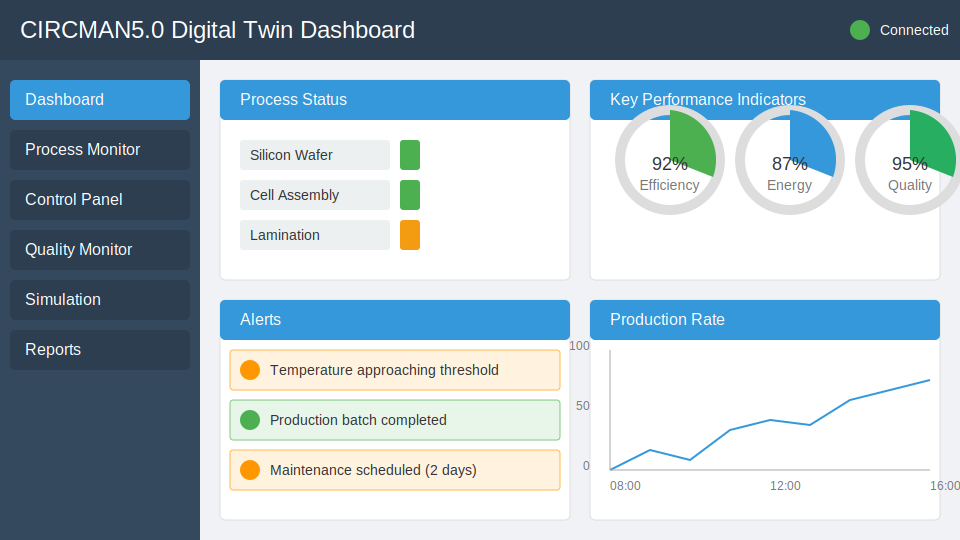

# Digital Twin Operator Manual

## 1. Introduction

This manual is designed for manufacturing operators who will be using the CIRCMAN5.0 Digital Twin system for photovoltaic (PV) manufacturing. It provides comprehensive instructions for daily operations, monitoring, control, and troubleshooting from an operator's perspective.

## 2. Getting Started

### 2.1 System Access

To access the Digital Twin system:

1. Launch the CIRCMAN5.0 application on your workstation
2. Log in with your operator credentials
3. The main dashboard will appear, showing the current manufacturing status
4. Verify the connection status indicator shows "Connected" in green

### 2.2 Understanding the Interface

The operator interface consists of these primary areas:

1. **Main Dashboard**: Central view showing manufacturing overview
2. **Process Panels**: Detailed views of specific manufacturing processes
3. **Control Panels**: Process control and parameter adjustment interfaces
4. **Alert Panel**: System for notifications and alerts
5. **Navigation Menu**: Access to different system views

### 2.3 Basic Navigation

To navigate the system:

1. Use the navigation menu on the left side to switch between different views
2. Click on process panels to expand detailed information
3. Use the tabs at the top of each panel to switch between different data views
4. Access the quick actions menu (⚙️) for frequently used functions

## 3. Monitoring Manufacturing Process

### 3.1 Dashboard Overview

The main dashboard provides a real-time overview of manufacturing:

1. **Process Status**: Current status of each manufacturing process
2. **Key Metrics**: Critical performance indicators at a glance
3. **Alert Summary**: Recent and active alerts
4. **Production Line Visualization**: Visual representation of the production line

### 3.2 Process Monitoring

To monitor specific processes:

1. Click on the process panel of interest (e.g., "Silicon Wafer Processing")
2. View real-time data for the selected process:
   - Current temperature and pressure
   - Energy consumption
   - Material flow
   - Production rate
3. Use the timeline slider to view historical data
4. Toggle between different visualization modes using the view selector

### 3.3 Understanding Status Indicators

The system uses color-coded status indicators:

| Color  | Status    | Description                             | Action Required              |
|--------|-----------|----------------------------------------|------------------------------|
| Green  | Normal    | Process operating within parameters     | Regular monitoring           |
| Yellow | Caution   | Process approaching parameter limits    | Increased monitoring         |
| Orange | Warning   | Process near threshold limits           | Preventive action needed     |
| Red    | Critical  | Process exceeding safe parameters       | Immediate intervention       |
| Blue   | Idle      | Process not currently running           | None                         |
| Gray   | Offline   | Process or monitoring system offline    | Check connectivity           |

### 3.4 Parameter Monitoring

To monitor specific parameters:

1. From any process panel, click "Parameters" tab
2. View current values for all process parameters
3. Parameters exceeding thresholds will be highlighted
4. Click on any parameter to view:
   - Current value and setpoint
   - Historical trend chart
   - Threshold limits
   - Suggested actions if needed

## 4. Process Control

### 4.1 Basic Process Control

To control manufacturing processes:

1. Navigate to the "Control" view using the navigation menu
2. Select the process you wish to control
3. Use the control panel to:
   - Start/stop processes
   - Adjust process parameters
   - Set production targets
   - View process status

### 4.2 Parameter Adjustment

To adjust process parameters:

1. Navigate to the "Parameters" tab for the relevant process
2. Locate the parameter you wish to adjust
3. Use the slider or input field to set the new value
4. Note that parameters have defined limits:
   - Soft limits (yellow background): Can be exceeded but not recommended
   - Hard limits (red background): Cannot be exceeded
5. Click "Apply" to implement the change
6. The system will confirm the parameter change was applied

### 4.3 Process Sequence Control

To control manufacturing sequence:

1. Navigate to the "Sequence" tab in the control panel
2. View the current process sequence
3. Use sequence controls to:
   - Start/pause sequence
   - Skip steps (if authorized)
   - Repeat steps
   - Reset sequence
4. Monitor sequence progress in real-time

### 4.4 Production Batch Management

To manage production batches:

1. Navigate to the "Batch Control" panel
2. View current and scheduled batches
3. Use batch controls to:
   - Start new batch
   - Set batch parameters
   - Track batch progress
   - Close completed batches
4. View batch quality metrics and yield data

## 5. Quality Monitoring

### 5.1 Quality Dashboard

To access quality monitoring:

1. Navigate to the "Quality" view in the navigation menu
2. The quality dashboard shows:
   - Current quality metrics
   - Defect rates
   - Quality trends
   - Statistical process control charts

### 5.2 Defect Monitoring

To monitor and analyze defects:

1. Navigate to the "Defects" tab in the quality view
2. View current defect data:
   - Defect types and rates
   - Defect locations and patterns
   - Pareto charts of defect causes
3. Use the defect analysis tools to identify patterns
4. View AI-suggested corrective actions

### 5.3 Quality Alerts

Quality alerts require special attention:

1. Quality alerts appear in the alert panel with a "Quality" tag
2. Click on the alert to view details:
   - Affected parameters
   - Quality impact assessment
   - Recommended actions
3. Implement recommended actions or consult with supervisor
4. Document all actions taken in the alert response field

## 6. Handling Alerts

### 6.1 Alert Panel

The alert panel provides notification of system events:

1. Access the alert panel by clicking the bell icon (🔔)
2. Alerts are color-coded by severity:
   - Red: Critical
   - Orange: Warning
   - Yellow: Caution
   - Blue: Information
3. Click on any alert to view details and recommended actions

### 6.2 Alert Response Protocol

When responding to alerts:

1. Read the complete alert description
2. Review the recommended actions
3. Implement appropriate measures based on your authorization level
4. Document your response in the alert response field
5. Mark the alert as "Acknowledged" or "Resolved" as appropriate
6. Escalate to supervisor if the alert is beyond your authorization

### 6.3 Alert History

To review past alerts:

1. Open the alert panel
2. Click "History" tab
3. Use filters to find specific alerts:
   - Date range
   - Severity
   - Process area
   - Alert type
4. Review alert details and responses
5. Export alert history for reporting if needed

## 7. Digital Twin Simulation

### 7.1 Viewing Simulations

The digital twin can run simulations to predict outcomes:

1. Navigate to the "Simulation" view
2. View active simulations:
   - Current simulation status
   - Predicted outcomes
   - Comparison with actual production
3. Use simulation visualization tools to explore predictions

### 7.2 Running What-If Scenarios

To run basic what-if scenarios (if authorized):

1. Navigate to the "What-If" tab in simulation view
2. Select the scenario template
3. Adjust parameters for your scenario
4. Click "Run Simulation"
5. View predicted outcomes
6. Compare multiple scenarios using the comparison view
7. Save useful scenarios for future reference

### 7.3 Understanding Simulation Results

Simulation results include:

1. **Predicted Parameters**: How parameters will change over time
2. **Quality Predictions**: Expected product quality
3. **Resource Usage**: Predicted resource consumption
4. **Efficiency Metrics**: Operational efficiency indicators
5. **Confidence Intervals**: Uncertainty in predictions

## 8. Shift Handover

### 8.1 Shift Summary

To prepare for shift handover:

1. Navigate to the "Reports" section
2. Select "Shift Summary"
3. Review the automatically generated shift report:
   - Production statistics
   - Quality metrics
   - Resource consumption
   - Significant events
   - Pending issues
4. Add your notes and observations
5. Save the report for handover

### 8.2 Handover Process

During shift handover:

1. Log out of your session
2. The incoming operator should log in with their credentials
3. Open the shift summary report
4. Review all items together
5. Discuss any specific concerns or pending tasks
6. Sign the digital handover form
7. The system will record the handover timestamp

## 9. Routine Maintenance

### 9.1 Digital Twin Synchronization

To ensure digital twin accuracy:

1. Verify synchronization status in the status bar
2. If synchronization shows "Warning" or "Error":
   - Click the sync indicator
   - View synchronization details
   - Follow the recommended actions
   - If problems persist, contact technical support

### 9.2 Data Quality Checks

To maintain data quality:

1. Navigate to "System" → "Data Quality"
2. Review data quality indicators:
   - Sensor health status
   - Data completeness metrics
   - Validation errors
3. Report any persistent data quality issues

## 10. Troubleshooting

### 10.1 Common Issues

#### 10.1.1 Interface Not Responding
1. Check network connection
2. Verify system status in the status bar
3. Try refreshing the view (F5)
4. If problem persists, restart the application

#### 10.1.2 Data Not Updating
1. Check synchronization status
2. Verify sensor connections
3. Check the last update timestamp
4. Try manual synchronization
5. Contact technical support if needed

#### 10.1.3 Parameter Changes Not Applied
1. Verify you have proper authorization
2. Check for validation errors in the parameter form
3. Ensure the process is in a state that allows changes
4. Try again with smaller incremental changes
5. Check event log for error messages

### 10.2 Getting Help

For assistance:

1. Use the built-in help system (press F1 or click ?)
2. Check the knowledge base for solutions
3. Contact shift supervisor for operational issues
4. Contact IT support for technical issues
5. Use the feedback form to report bugs or suggestions

## 11. Appendices

### 11.1 Keyboard Shortcuts

| Function                     | Shortcut       |
|------------------------------|----------------|
| Open main dashboard          | Alt+1          |
| Open process monitoring      | Alt+2          |
| Open control panel           | Alt+3          |
| Open quality view            | Alt+4          |
| Open simulation view         | Alt+5          |
| Refresh current view         | F5             |
| Open help                    | F1             |
| Acknowledge selected alert   | Alt+A          |
| Start selected process       | Ctrl+Shift+S   |
| Stop selected process        | Ctrl+Shift+T   |
| Generate shift report        | Ctrl+Shift+R   |
| Toggle fullscreen            | F11            |

### 11.2 Status Code Reference

| Code | Description                | Recommended Action                        |
|------|----------------------------|------------------------------------------|
| E001 | Communication failure      | Check network and restart application     |
| E002 | Sensor data error          | Check sensor connections                  |
| E003 | Parameter validation error | Review parameter limits                   |
| E004 | Process control error      | Check process status before retry         |
| E005 | Database error             | Contact IT support                        |
| W001 | Parameter near limit       | Monitor closely and adjust if needed      |
| W002 | Resource running low       | Schedule resource replenishment           |
| W003 | Quality metric deviation   | Check process parameters                  |
| I001 | Process completed          | Review quality metrics                    |
| I002 | Batch started              | Verify batch parameters                   |

### 11.3 Reporting Forms

The system includes these standard reporting forms:

1. **Shift Report**: Daily shift summary
2. **Incident Report**: For documenting issues
3. **Quality Deviation Report**: For quality problems
4. **Maintenance Request**: For equipment maintenance
5. **Improvement Suggestion**: For process improvements

Access these forms from the "Reports" menu.

## 12. Glossary

- **Digital Twin**: Digital representation of the physical manufacturing system
- **Parameter**: Configurable value affecting process behavior
- **Setpoint**: Target value for a controlled parameter
- **Process Variable (PV)**: Actual measured value of a parameter
- **Alert**: Notification of important system event
- **Threshold**: Boundary value triggering alerts or actions
- **Batch**: Group of products manufactured together
- **Yield**: Percentage of good products from total production
- **SPC**: Statistical Process Control
- **KPI**: Key Performance Indicator
