# CIRCMAN5.0 Digital Twin Technical Manual

## 1. System Architecture

### 1.1 Architectural Overview

The CIRCMAN5.0 Digital Twin implements a modular, component-based architecture with clear separation of concerns:

```
┌─────────────────────────────────────────────────────────────┐
│                      Core System                            │
│  ┌─────────────┐  ┌────────────────┐  ┌──────────────────┐  │
│  │Configuration│  │Results Manager │  │ Logging System  │  │
│  └─────────────┘  └────────────────┘  └──────────────────┘  │
└─────────────────────────────────────────────────────────────┘
                           │
                           ▼
┌─────────────────────────────────────────────────────────────┐
│                    Digital Twin System                      │
│                                                             │
│  ┌─────────────┐  ┌────────────────┐  ┌──────────────────┐  │
│  │Digital Twin │  │State Manager   │  │Synchronization   │  │
│  │    Core     │◄─┼────────────────┼─►│     Engine       │  │
│  └─────┬───────┘  └────────────────┘  └──────────────────┘  │
│        │                 ▲                      ▲            │
│        ▼                 │                      │            │
│  ┌─────────────┐  ┌─────┴──────────┐  ┌────────┴─────────┐  │
│  │Simulation   │  │Event           │  │Scenario          │  │
│  │Engine       │  │Notification    │  │Manager           │  │
│  └─────────────┘  └────────────────┘  └──────────────────┘  │
└────────┬───────────────────┬────────────────────┬───────────┘
         │                   │                    │
         ▼                   ▼                    ▼
┌────────────────┐  ┌────────────────┐  ┌──────────────────┐
│AI Integration  │  │LCA Integration │  │Human Interface   │
└────────────────┘  └────────────────┘  └──────────────────┘
```

### 1.2 Component Architecture

The system is composed of these primary components:

#### 1.2.1 Core System
- **Configuration System**: Centralized configuration management
- **Results Manager**: File and path management for outputs
- **Logging System**: Structured logging and diagnostic capabilities

#### 1.2.2 Digital Twin System
- **Digital Twin Core**: Central coordinator for the digital representation
- **State Manager**: State management and history tracking
- **Synchronization Engine**: Physical-digital state synchronization
- **Simulation Engine**: Physics-based process simulation
- **Event Notification System**: Asynchronous event distribution
- **Scenario Manager**: Simulation scenario management

#### 1.2.3 Integration Systems
- **AI Integration**: Machine learning and optimization capabilities
- **LCA Integration**: Lifecycle assessment and environmental analysis
- **Human Interface**: Operator and user interfaces

### 1.3 Deployment Architecture

The system supports several deployment configurations:

#### 1.3.1 Standalone Deployment
```
┌─────────────────────────────────────────────┐
│                Application Server            │
│                                             │
│  ┌─────────────┐     ┌────────────────────┐ │
│  │CIRCMAN5.0   │     │Local Database      │ │
│  │Application  │◄───►│                    │ │
│  └─────────────┘     └────────────────────┘ │
│         ▲                                   │
└─────────┼───────────────────────────────────┘
          │
┌─────────┼───────────────────────────────────┐
│ ┌───────▼─────┐                             │
│ │Web Browser  │                             │
│ └─────────────┘                             │
│         Client System                       │
└─────────────────────────────────────────────┘
```

#### 1.3.2 Distributed Deployment
```
┌───────────────────┐  ┌───────────────────┐  ┌───────────────────┐
│ Application Server │  │ Processing Server │  │ Database Server   │
│                   │  │                   │  │                   │
│ ┌───────────────┐ │  │ ┌───────────────┐ │  │ ┌───────────────┐ │
│ │CIRCMAN5.0 Web │ │  │ │Simulation and │ │  │ │   Database    │ │
│ │   Frontend    │◄┼──┼►│ AI Processing │◄┼──┼►│               │ │
│ └───────────────┘ │  │ └───────────────┘ │  │ └───────────────┘ │
└───────────────────┘  └───────────────────┘  └───────────────────┘
          ▲
          │
┌─────────┼───────────────────────────────────┐
│ ┌───────▼─────┐                             │
│ │Web Browser  │                             │
│ └─────────────┘                             │
│         Client System                       │
└─────────────────────────────────────────────┘
```




```mermaid
flowchart TB
    subgraph External ["External Systems"]
        Sensors["Sensors\nReal-time data"]
        MES["Manufacturing System\nProcess data"]
        User["User Input\nParameters & controls"]
    end
    subgraph DT ["Digital Twin Core"]
        TwinCore["Twin Core\n(twin_core.py)\nCentral coordinator"]
        StateManager["State Manager\n(state_manager.py)\nState tracking & history"]
        Sync["Synchronization\n(synchronization.py)\nPhysical-digital sync"]
        EventManager["Event Manager\n(event_manager.py)\nEvent distribution"]
    end
    subgraph Simulation ["Simulation System"]
        SimEngine["Simulation Engine\n(simulation_engine.py)\nProcess simulation"]
        Process["Process Models\n(process_models.py)\nPhysics-based models"]
        Scenario["Scenario Manager\n(scenario_manager.py)\nWhat-if analysis"]
    end
    subgraph Integration ["Integration Components"]
        AI["AI Integration\n(ai_integration.py)\nOptimization & prediction"]
        LCA["LCA Integration\n(lca_integration.py)\nEnvironmental assessment"]
        Config["Configuration\n(config_adapter.py)\nParameter management"]
    end
    subgraph HMI ["Human-Machine Interface"]
        Interface["Interface Manager\n(interface_manager.py)\nUI coordination"]
        Dashboard["Dashboard\n(dashboard.py)\nVisualization"]
        Controls["Control Panel\n(control_panel.py)\nUser controls"]
        Alerts["Alert System\n(alert_panel.py)\nNotifications"]
    end
    %% External to DT connections
    Sensors -->|"Data input"| TwinCore
    MES -->|"Process data"| TwinCore
    User -->|"Parameters"| Interface
    %% Digital Twin core connections
    TwinCore <-->|"State updates"| StateManager
    TwinCore <-->|"Synchronization"| Sync
    TwinCore <-->|"Event publishing"| EventManager
    TwinCore <-->|"Simulation requests"| SimEngine
    %% Simulation connections
    SimEngine <-->|"Process modeling"| Process
    SimEngine <-->|"Scenario execution"| Scenario

    %% Integration connections
    TwinCore <-->|"Optimization"| AI
    TwinCore <-->|"Environmental assessment"| LCA
    TwinCore <-->|"Configuration"| Config

    %% HMI connections
    Interface <-->|"Digital twin adapter"| TwinCore
    Interface -->|"Updates"| Dashboard
    Interface -->|"Control flow"| Controls
    EventManager -->|"Event subscription"| Alerts
    Interface <-->|"Alert display"| Alerts
    %% Style definitions
    classDef core fill:#f9f,stroke:#333,stroke-width:2px;
    classDef simulation fill:#bbf,stroke:#333,stroke-width:1px;
    classDef integration fill:#bfb,stroke:#333,stroke-width:1px;
    classDef hmi fill:#fbb,stroke:#333,stroke-width:1px;
    classDef external fill:#ddd,stroke:#333,stroke-width:1px;

    %% Apply styles
    class TwinCore,StateManager,Sync,EventManager core;
    class SimEngine,Process,Scenario simulation;
    class AI,LCA,Config integration;
    class Interface,Dashboard,Controls,Alerts hmi;
    class Sensors,MES,User external;
```

## 2. Technical Specifications

### 2.1 System Requirements

#### 2.1.1 Server Requirements
- **Processor**: 8+ cores, 3.0+ GHz (Intel Xeon or AMD EPYC recommended)
- **Memory**: 32GB+ RAM (64GB+ recommended for large deployments)
- **Storage**: 512GB SSD minimum for application, 1TB+ for data storage
- **Network**: 1Gbps Ethernet, low-latency connection to manufacturing systems
- **Operating System**:
  - Linux: Ubuntu 20.04 LTS or newer, Red Hat Enterprise Linux 8+
  - Windows: Windows Server 2019 or newer

#### 2.1.2 Client Requirements
- **Processor**: 4+ cores, 2.5+ GHz
- **Memory**: 8GB+ RAM (16GB recommended)
- **Display**: 1920x1080 resolution minimum, 24"+ monitor recommended
- **Browser**: Chrome 90+, Firefox 90+, Edge 90+
- **Network**: 100Mbps+ connection to application server

### 2.2 Technology Stack

#### 2.2.1 Backend
- **Programming Language**: Python 3.11+
- **Application Framework**: Custom component-based architecture
- **Data Processing**: pandas, numpy, scikit-learn
- **Simulation**: Custom physics-based simulation engine
- **Machine Learning**: scikit-learn, TensorFlow/PyTorch integration capability
- **API**: REST API with JSON serialization
- **Database**: SQLite (standalone), PostgreSQL (distributed)

#### 2.2.2 Frontend
- **Framework**: Web-based interface
- **Visualization**: D3.js, Three.js, Plotly
- **UI Components**: React-based components
- **State Management**: Custom state management system
- **Data Communication**: WebSockets for real-time updates, REST for requests

#### 2.2.3 Integration
- **Data Formats**: JSON, CSV, XML
- **Communication**: REST, WebSockets
- **Authentication**: JWT-based authentication
- **Authorization**: Role-based access control
- **Security**: TLS encryption, input validation, OWASP security practices

### 2.3 Performance Specifications

#### 2.3.1 Processing Performance
- **State Update Frequency**: Up to 10Hz standard, 100Hz high-performance mode
- **Simulation Speed**: 100-1000x real-time (configuration dependent)
- **Optimization Speed**: ~60 seconds for standard optimization problems
- **LCA Calculation**: ~30 seconds for comprehensive assessment
- **Concurrent Users**: 20+ standard, 100+ with performance optimization
- **Data Processing**: Up to 10GB of manufacturing data per day

#### 2.3.2 Storage Requirements
- **Application**: ~500MB base installation
- **Configuration**: ~50MB for standard deployment
- **State History**: ~100MB per day of operation (configuration dependent)
- **Simulation Results**: ~200MB per day of active use
- **Analysis Data**: ~500MB per month of operation

## 3. Digital Twin Core

### 3.1 Core Architecture

The Digital Twin Core (`twin_core.py`) serves as the central coordinator for the digital twin system. It implements a singleton pattern to ensure only one instance exists across the application:

```python
def __new__(cls, config=None):
    """Ensure only one instance is created."""
    if cls._instance is None:
        cls._instance = super(DigitalTwin, cls).__new__(cls)
    return cls._instance
```

Key components within the Digital Twin Core:

```python
class DigitalTwin:
    def __init__(self, config=None):
        """Initialize digital twin with optional configuration."""
        self._initialized = False
        self.is_running = False

        # Load configuration
        self.config = config or DigitalTwinConfig.from_constants()

        # Initialize components
        self.state_manager = StateManager(history_length=self.config.history_length)
        self.event_publisher = DigitalTwinPublisher()
        self.logger = setup_logger("digital_twin_core")

        # Integration components initialized in _init_integrations
```

### 3.2 Initialization Sequence

The Digital Twin initializes in a specific sequence:

1. **Configuration Loading**: Load and validate configuration
2. **Component Initialization**: Create required components
3. **State Initialization**: Initialize state from default or loaded state
4. **Integration Setup**: Initialize integration components
5. **Event Notification**: Publish initialization events
6. **Self-check**: Validate system integrity

```python
def initialize(self):
    """Initialize the digital twin with initial state and connections."""
    if self._initialized:
        self.logger.warning("Digital twin already initialized")
        return True

    try:
        # Initialize state
        initial_state = self._get_initial_state()
        self.state_manager.set_state(initial_state)

        # Initialize integrations
        self._init_integrations()

        # Set up parameter thresholds
        self._init_parameter_thresholds()

        # Publish initialization event
        self.event_publisher.publish_event(
            category=EventCategory.SYSTEM,
            message="Digital twin initialized",
            severity=EventSeverity.INFO
        )

        self._initialized = True
        self.is_running = True
        return True
    except Exception as e:
        self.logger.error(f"Error initializing digital twin: {str(e)}")
        return False
```

### 3.3 State Update Cycle

The Digital Twin implements a state update cycle that includes:

1. **Data Collection**: Collect data from external sources
2. **State Update**: Apply new data to current state
3. **Threshold Checking**: Check parameters against defined thresholds
4. **Event Publication**: Publish events for state changes
5. **History Management**: Add updated state to history

```python
def update(self, external_data=None):
    """Update digital twin state with new data."""
    if not self._initialized:
        self.logger.warning("Digital twin not initialized")
        return False

    try:
        # Get current state
        previous_state = self.state_manager.get_current_state()

        # Collect data
        sensor_data = self._collect_sensor_data()
        system_data = self._collect_system_data()

        # Merge data sources
        update_data = {}
        update_data.update(sensor_data)
        update_data.update(system_data)
        if external_data:
            update_data.update(external_data)

        # Apply timestamp
        update_data["timestamp"] = datetime.now().isoformat()

        # Update state
        self.state_manager.update_state(update_data)
        updated_state = self.state_manager.get_current_state()

        # Check thresholds
        self._check_parameter_thresholds(updated_state)

        # Publish state update event
        self.event_publisher.publish_state_update(previous_state, updated_state)

        return True
    except Exception as e:
        self.logger.error(f"Error updating digital twin: {str(e)}")
        return False
```

### 3.4 Simulation Process

The Digital Twin implements a simulation process that uses the Simulation Engine:

```python
def simulate(self, steps=None, parameters=None):
    """Run a simulation based on the current state."""
    if not self._initialized:
        self.logger.warning("Digital twin not initialized")
        return []

    try:
        # Use default steps if not specified
        steps = steps or self.config.simulation_steps

        # Get current state as starting point
        initial_state = self.state_manager.get_current_state()

        # Run simulation
        simulation_results = self.simulation_engine.run_simulation(
            steps=steps,
            initial_state=initial_state,
            parameters=parameters
        )

        # Publish simulation event
        self.event_publisher.publish_simulation_result(
            simulation_id=str(uuid.uuid4()),
            parameters=parameters,
            results=simulation_results
        )

        return simulation_results
    except Exception as e:
        self.logger.error(f"Error in simulation: {str(e)}")
        return []
```

## 4. State Management System

### 4.1 State Structure

The digital twin state follows a standardized hierarchical structure:

```json
{
    "timestamp": "2025-02-24T14:30:22.123456",
    "system_status": "running",
    "production_line": {
        "status": "running",
        "temperature": 22.5,
        "energy_consumption": 120.5,
        "production_rate": 8.3,
        "efficiency": 0.92,
        "defect_rate": 0.02
    },
    "materials": {
        "silicon_wafer": {
            "inventory": 850,
            "quality": 0.95
        },
        "solar_glass": {
            "inventory": 420,
            "quality": 0.98
        }
    },
    "environment": {
        "temperature": 22.0,
        "humidity": 45.0
    }
}
```

### 4.2 State Manager Implementation

The StateManager (`state_manager.py`) implements a thread-safe state management system:

```python
class StateManager:
    """Manager for digital twin state."""

    _instance = None
    _init_lock = threading.Lock()

    def __new__(cls, *args, **kwargs):
        """Ensure only one instance is created."""
        if cls._instance is None:
            with cls._init_lock:
                if cls._instance is None:
                    cls._instance = super(StateManager, cls).__new__(cls)
        return cls._instance

    def __init__(self, history_length=None):
        """Initialize with optional history length."""
        # Only initialize once
        if hasattr(self, "_initialized") and self._initialized:
            return

        # Load configuration
        self.constants = ConstantsService()
        self.dt_config = self.constants.get_digital_twin_config()
        self.history_length = history_length or self.dt_config.get(
            "STATE_MANAGEMENT", {}).get("default_history_length", 1000)

        # Initialize state storage
        self.current_state = None
        self.state_history = collections.deque(maxlen=self.history_length)

        # Thread safety
        self._lock = threading.RLock()

        # Logging
        self.logger = setup_logger("state_manager")

        self._initialized = True
```

The state manager provides thread-safe operations for state manipulation:

```python
def set_state(self, state):
    """Set the current state and add to history."""
    valid, message = self.validate_state(state)
    if not valid:
        self.logger.warning(f"Invalid state: {message}")
        return

    with self._lock:
        if self.current_state:
            self.state_history.append(copy.deepcopy(self.current_state))
        self.current_state = copy.deepcopy(state)
```

### 4.3 State Validation

The state manager implements validation to ensure data integrity:

```python
def validate_state(self, state):
    """Validate a state dictionary."""
    # Check if state is a dictionary
    if not isinstance(state, dict):
        return False, "State must be a dictionary"

    # Check required fields
    if "timestamp" not in state:
        return False, "Missing 'timestamp' field"

    # Validate timestamp format
    try:
        timestamp = state["timestamp"]
        if isinstance(timestamp, str):
            datetime.fromisoformat(timestamp)
    except (ValueError, TypeError):
        return False, "Invalid timestamp format"

    # Additional validation logic...

    return True, "Valid state"
```

### 4.4 State History Management

The StateManager implements efficient history tracking using a deque:

```python
def get_history(self, limit=None):
    """Get historical states."""
    with self._lock:
        if limit is None or limit >= len(self.state_history):
            return list(self.state_history)
        else:
            # Return most recent 'limit' states
            return list(itertools.islice(
                self.state_history,
                len(self.state_history) - limit,
                len(self.state_history)
            ))
```

## 5. Simulation Engine

### 5.1 Simulation Architecture

The SimulationEngine (`simulation_engine.py`) implements physics-based modeling of manufacturing processes:

```python
class SimulationEngine:
    """Engine for digital twin simulation."""

    def __init__(self, state_manager):
        """Initialize with state manager."""
        self.state_manager = state_manager
        self.logger = setup_logger("simulation_engine")
        self.constants = ConstantsService()

        # Load simulation parameters
        self.simulation_config = self.constants.get_digital_twin_config().get(
            "SIMULATION_PARAMETERS", {})
```

### 5.2 Simulation Process

The simulation engine implements a step-by-step simulation process:

```python
def run_simulation(self, steps=10, initial_state=None, parameters=None):
    """Run simulation for specified steps."""
    # Get initial state if not provided
    if initial_state is None:
        initial_state = self.state_manager.get_current_state()

    # Make a copy to avoid modifying original
    current_state = copy.deepcopy(initial_state)

    # Apply parameter modifications if provided
    if parameters:
        current_state = self._apply_parameters(current_state, parameters)

    # Initialize results with the initial state
    results = [copy.deepcopy(current_state)]

    # Run simulation steps
    for _ in range(steps):
        # Generate next state
        next_state = self._simulate_next_state(current_state)

        # Add to results
        results.append(copy.deepcopy(next_state))

        # Update current state for next iteration
        current_state = next_state

    return results
```

### 5.3 Physics-Based Modeling

The simulation engine implements mathematical models for manufacturing processes:

```python
def _simulate_production_line(self, state):
    """Simulate production line behavior."""
    if "production_line" not in state:
        return state

    production_line = state["production_line"]
    status = production_line.get("status", "idle")

    # Temperature dynamics
    if "temperature" in production_line:
        temperature = production_line["temperature"]
        target_temp = self.simulation_config.get("target_temperature", 22.5)
        temp_regulation = self.simulation_config.get("temperature_regulation", 0.1)

        # Temperature approaches target with some regulation factor
        # T(t+1) = T(t) + (T_target - T(t)) * regulation + random
        random_factor = random.normalvariate(0, 0.1)
        new_temp = temperature + (target_temp - temperature) * temp_regulation + random_factor
        production_line["temperature"] = round(new_temp, 1)

    # Energy consumption dynamics
    if "energy_consumption" in production_line:
        energy = production_line["energy_consumption"]
        energy_increment = self.simulation_config.get("energy_consumption_increment", 2.0)

        if status == "running":
            # Running state: energy increases with variation
            random_factor = random.normalvariate(1.0, 0.1)
            new_energy = energy + energy_increment * random_factor
        else:
            # Idle state: energy slowly decreases
            new_energy = energy * 0.95

        production_line["energy_consumption"] = round(new_energy, 1)

    # Additional models for production rate, efficiency, etc...

    state["production_line"] = production_line
    return state
```

### 5.4 Monte Carlo Simulation Support

The simulation engine supports Monte Carlo simulations for uncertainty analysis:

```python
def run_monte_carlo_simulation(self, steps=10, initial_state=None,
                              parameters=None, iterations=100,
                              uncertainty=0.1):
    """Run Monte Carlo simulation with parameter variation."""
    results = []

    for i in range(iterations):
        # Create parameter variation
        if parameters:
            varied_params = self._create_parameter_variation(
                parameters, uncertainty)
        else:
            varied_params = None

        # Run single simulation
        sim_result = self.run_simulation(
            steps=steps,
            initial_state=initial_state,
            parameters=varied_params
        )

        # Add to results
        results.append({
            "iteration": i,
            "parameters": varied_params,
            "states": sim_result
        })

    return results
```

## 6. Event Notification System

### 6.1 Event System Architecture

The Event Notification System implements a publisher-subscriber pattern:

```
Publishers                   Event Manager                Subscribers
+----------+                +--------------+             +------------+
| Digital  |                |              |             | HMI        |
| Twin     |---events------>| Event Manager|---events--->| Components |
+----------+                |              |             +------------+
                            |              |
+----------+                |              |             +------------+
| AI       |                | * Filtering  |             | Logging    |
| System   |---events------>| * Routing    |---events--->| System     |
+----------+                | * Persistence|             +------------+
                            +--------------+
+----------+                      |                      +------------+
| LCA      |                      |                      | Persistence|
| System   |---events-------------|                      | System     |
+----------+                      |----------------------+------------+
```

### 6.2 Event Manager Implementation

The EventManager (`event_manager.py`) implements a singleton pattern:

```python
class EventManager:
    """Central event management system."""

    _instance = None

    def __new__(cls):
        """Ensure singleton pattern."""
        if cls._instance is None:
            cls._instance = super(EventManager, cls).__new__(cls)
            cls._instance._initialized = False
        return cls._instance

    def __init__(self):
        """Initialize event manager."""
        if self._initialized:
            return

        # Initialize structures
        self.logger = setup_logger("event_manager")
        self.constants = ConstantsService()
        self._load_config()

        # Subscriber management
        self.subscribers = {category: [] for category in EventCategory}
        self.severity_subscribers = {severity: [] for severity in EventSeverity}

        # Filter management
        self.category_filters = {category: [] for category in EventCategory}

        # Event persistence
        self.persistence = EventPersistence()

        # Thread safety
        self._lock = threading.RLock()

        self._initialized = True
```

### 6.3 Publisher Implementation

Event publishers use a common base class:

```python
class EventPublisherBase:
    """Base class for event publishers."""

    def __init__(self, source_name):
        """Initialize with source name."""
        self.source_name = source_name
        self.event_manager = event_manager

    def publish(self, event):
        """Publish an event to the event manager."""
        self.event_manager.publish(event)
```

Specialized publishers extend this base class:

```python
class DigitalTwinPublisher(EventPublisherBase):
    """Publisher for Digital Twin events."""

    def __init__(self):
        """Initialize publisher."""
        super().__init__("digital_twin")

    def publish_state_update(self, previous_state, updated_state):
        """Publish state update event."""
        # Extract state status
        prev_status = previous_state.get("system_status", "unknown")
        new_status = updated_state.get("system_status", "unknown")

        # Create and publish event
        event = SystemStateEvent(
            previous_state=prev_status,
            new_state=new_status,
            source=self.source_name,
            details={"timestamp": updated_state.get("timestamp")}
        )
        self.publish(event)
```

### 6.4 Event Types

The system defines structured event types:

```python
@dataclass
class Event:
    """Base class for all events in the system."""
    event_id: str = field(default_factory=lambda: str(uuid.uuid4()))
    timestamp: str = field(default_factory=lambda: datetime.now().isoformat())
    category: EventCategory = EventCategory.SYSTEM
    severity: EventSeverity = EventSeverity.INFO
    source: str = "system"
    message: str = ""
    details: Dict[str, Any] = field(default_factory=dict)
    acknowledged: bool = False
```

Specialized event types define specific event structures:

```python
@dataclass
class ThresholdEvent(Event):
    """Event for threshold breaches."""
    def __init__(self, parameter: str, threshold: float, actual_value: float, **kwargs):
        # Extract severity (default to WARNING)
        severity = kwargs.pop("severity", EventSeverity.WARNING)

        # Create details with threshold information
        details = {
            "parameter": parameter,
            "threshold": threshold,
            "actual_value": actual_value,
            **kwargs.pop("details", {})
        }

        # Initialize with threshold category and breach message
        super().__init__(
            category=EventCategory.THRESHOLD,
            severity=severity,
            message=f"Threshold breach: {parameter} exceeded {threshold} with value {actual_value}",
            details=details,
            **kwargs
        )
```

## 7. AI Integration System

### 7.1 AI Integration Architecture

The AI Integration module connects the digital twin with AI components:

```
Digital Twin <──> AIIntegration <──> ML Models
                        │
                        └────> Process Optimizer
```

### 7.2 ML Model Architecture

The manufacturing model implements machine learning capabilities:

```python
class ManufacturingModel:
    """Machine learning model for manufacturing optimization."""

    def __init__(self, config=None):
        """Initialize with optional configuration."""
        self.config = config or {}
        self.logger = setup_logger("manufacturing_model")
        self.constants = ConstantsService()

        # Initialize model components
        self.regression_model = None
        self.classification_model = None
        self.feature_processor = None
        self.is_trained = False

        # Load model if available
        self._load_default_model()
```

### 7.3 Optimization Implementation

The process optimizer implements optimization algorithms:

```python
class ProcessOptimizer:
    """Optimizer for manufacturing process parameters."""

    def __init__(self, model, config=None):
        """Initialize with model and configuration."""
        self.model = model
        self.config = config or {}
        self.logger = setup_logger("process_optimizer")
        self.constants = ConstantsService()

        # Load optimization config
        optimization_config = self.constants.get_optimization_config()
        self.default_constraints = optimization_config.get(
            "DEFAULT_CONSTRAINTS", {})

    def optimize_process_parameters(self, current_params, constraints=None):
        """Optimize process parameters."""
        try:
            # Apply default constraints if not provided
            effective_constraints = self.default_constraints.copy()
            if constraints:
                effective_constraints.update(constraints)

            # Define objective function
            def objective(params_array):
                # Convert from array to dictionary
                params_dict = self._array_to_dict(params_array, current_params)

                # Predict outcomes
                prediction = self.model.predict_batch_outcomes(params_dict)

                # Calculate objective value (lower is better)
                obj_value = (
                    - prediction.get("efficiency", 0) * 100 +
                    prediction.get("energy_consumption", 0) * 0.1 +
                    prediction.get("defect_rate", 0) * 1000
                )

                return obj_value

            # Set up optimization
            param_names = list(current_params.keys())
            initial_guess = np.array([current_params[name] for name in param_names])
            bounds = self._get_optimization_bounds(param_names, effective_constraints)

            # Run optimization
            result = minimize(
                objective,
                initial_guess,
                method='L-BFGS-B',
                bounds=bounds
            )

            # Convert result back to dictionary
            optimized_params = self._array_to_dict(result.x, current_params)

            return optimized_params
        except Exception as e:
            self.logger.error(f"Optimization error: {str(e)}")
            return current_params.copy()
```

### 7.4 AI Integration Implementation

The AIIntegration class connects the digital twin with AI components:

```python
class AIIntegration:
    """Integration between Digital Twin and AI components."""

    def __init__(self, digital_twin, model=None, optimizer=None):
        """Initialize with digital twin and optional components."""
        self.digital_twin = digital_twin
        self.model = model or ManufacturingModel()
        self.optimizer = optimizer or ProcessOptimizer(self.model)

        self.logger = setup_logger("ai_integration")
        self.constants = ConstantsService()

        # Load configuration
        self.config = self.constants.get_digital_twin_config().get(
            "AI_INTEGRATION", {})

        # Load parameter mapping
        self.parameter_mapping = self.config.get("PARAMETER_MAPPING", {})

        # Track optimization history
        self.optimization_history = []

    def extract_parameters_from_state(self, state=None):
        """Extract relevant parameters from digital twin state."""
        if state is None:
            state = self.digital_twin.get_current_state()

        # Extract process parameters
        params = {}
        if "production_line" in state:
            pl = state["production_line"]
            for param, value in pl.items():
                if isinstance(value, (int, float)):
                    params[param] = value

        # Apply parameter mapping
        mapped_params = {}
        for dt_param, ai_param in self.parameter_mapping.items():
            if dt_param in params:
                mapped_params[ai_param] = params[dt_param]

        return mapped_params
```

## 8. LCA Integration System

### 8.1 LCA Integration Architecture

The LCA Integration connects digital twin with environmental assessment:

```
Digital Twin <──> LCAIntegration <──> LCAAnalyzer
                          │
                          └────> LCAVisualizer
```

### 8.2 LCA Analyzer Implementation

The LCA Analyzer implements environmental impact calculations:

```python
class LCAAnalyzer:
    """Analyzer for lifecycle environmental impact."""

    def __init__(self, impact_factors=None):
        """Initialize with impact factors."""
        self.logger = setup_logger("lca_analyzer")
        self.constants = ConstantsService()

        # Load impact factors
        if impact_factors:
            self.impact_factors = impact_factors
        else:
            self.impact_factors = self.constants.get_impact_factors()

    def perform_full_lca(self, material_inputs, energy_consumption,
                         lifetime_years, annual_energy_generation,
                         grid_carbon_intensity, recycling_rates,
                         transport_distance):
        """Perform complete lifecycle assessment."""
        try:
            # Calculate manufacturing impact
            manufacturing_impact = self.calculate_manufacturing_impact(
                material_inputs, energy_consumption)

            # Calculate use phase impact
            use_phase_impact = self.calculate_use_phase_impact(
                lifetime_years, annual_energy_generation, grid_carbon_intensity)

            # Calculate end-of-life impact
            end_of_life_impact = self.calculate_end_of_life_impact(
                material_inputs, recycling_rates, transport_distance)

            # Calculate recycling benefit
            recycling_benefit = self.calculate_recycling_benefit(
                material_inputs, recycling_rates)

            # Create impact object
            impact = LifeCycleImpact(
                manufacturing_impact=manufacturing_impact,
                use_phase_impact=use_phase_impact,
                end_of_life_impact=end_of_life_impact,
                recycling_benefit=recycling_benefit
            )

            return impact
        except Exception as e:
            self.logger.error(f"Error in LCA calculation: {str(e)}")
            raise
```

### 8.3 Impact Calculations

The LCA system implements detailed impact calculation algorithms:

```python
def calculate_manufacturing_impact(self, material_inputs, energy_consumption):
    """Calculate manufacturing phase impact."""
    impact = 0.0

    # Material impact
    material_factors = self.impact_factors.get("MATERIAL_IMPACT_FACTORS", {})
    for material, quantity in material_inputs.items():
        if material in material_factors:
            impact += quantity * material_factors[material]

    # Energy impact
    energy_factor = self.impact_factors.get("ENERGY_IMPACT_FACTOR", 0.5)
    impact += energy_consumption * energy_factor

    return impact

def calculate_use_phase_impact(self, lifetime_years, annual_energy_generation,
                              grid_carbon_intensity):
    """Calculate use phase impact."""
    # Calculate avoided emissions from renewable generation
    total_generation = annual_energy_generation * lifetime_years
    avoided_emissions = total_generation * grid_carbon_intensity

    # PV systems typically have minimal operational impact
    operational_impact = total_generation * 0.01  # Minimal maintenance impact

    # Net impact (negative value represents environmental benefit)
    return operational_impact - avoided_emissions
```

### 8.4 LCA Integration Implementation

The LCAIntegration class connects the digital twin with LCA components:

```python
class LCAIntegration:
    """Integration between Digital Twin and LCA components."""

    def __init__(self, digital_twin, lca_analyzer=None, lca_visualizer=None):
        """Initialize with digital twin and optional components."""
        self.digital_twin = digital_twin
        self.lca_analyzer = lca_analyzer or LCAAnalyzer()
        self.lca_visualizer = lca_visualizer or LCAVisualizer()

        self.logger = setup_logger("lca_integration")
        self.constants = ConstantsService()

        # Store LCA results history
        self.lca_results_history = []

    def extract_material_data_from_state(self, state=None):
        """Extract material flow data from digital twin state."""
        if state is None:
            state = self.digital_twin.get_current_state()

        # Create data structure
        data = []
        timestamp = state.get("timestamp", datetime.now().isoformat())
        batch_id = state.get("batch_id", "unknown")

        # Extract material data
        if "materials" in state:
            materials = state["materials"]
            for material_type, properties in materials.items():
                if isinstance(properties, dict):
                    entry = {
                        "batch_id": batch_id,
                        "timestamp": timestamp,
                        "material_type": material_type,
                        "quantity_used": properties.get("consumption", 0),
                        "waste_generated": properties.get("waste", 0),
                        "recycled_amount": properties.get("recycled", 0)
                    }
                    data.append(entry)

        return pd.DataFrame(data)
```

## 9. Human Interface System

### 9.1 Interface Architecture

The Human Interface system follows a component-based architecture:

```
InterfaceManager
├── Core Components
│   ├── InterfaceState - Global state management
│   ├── DashboardManager - Dashboard coordination
│   └── EventAdapter - Event system integration
│
├── Dashboard Components
│   ├── MainDashboard - Top-level dashboard
│   ├── ProcessPanel - Process visualization
│   ├── KPIPanel - Key performance indicators
│   └── StatusPanel - System status information
│
├── Control Components
│   ├── ParameterControl - Parameter adjustment
│   ├── ProcessControl - Process manipulation
│   └── ScenarioControl - Scenario management
│
└── Alert Components
    ├── AlertPanel - Alert display
    ├── NotificationManager - Alert management
    └── EventSubscriber - Event subscription
```

### 9.2 Interface Manager Implementation

The InterfaceManager implements a singleton pattern:

```python
class InterfaceManager:
    """Central manager for Human-Machine Interface system."""

    _instance = None

    def __new__(cls):
        """Ensure singleton pattern."""
        if cls._instance is None:
            cls._instance = super(InterfaceManager, cls).__new__(cls)
            cls._instance._initialized = False
        return cls._instance

    def __init__(self):
        """Initialize interface manager."""
        if self._initialized:
            return

        # Initialize components
        self.logger = setup_logger("interface_manager")
        self.constants = ConstantsService()
        self.state = InterfaceState()

        # Component registry
        self.components = {}

        # Event handling
        self.event_handlers = {}
        self.event_adapter = None  # Initialized later

        # Thread safety
        self._lock = threading.RLock()

        self._initialized = False
```

### 9.3 Digital Twin Adapter

The DigitalTwinAdapter connects the interface with digital twin:

```python
class DigitalTwinAdapter:
    """Adapter for Digital Twin access from HMI."""

    _instance = None

    def __new__(cls):
        """Ensure singleton pattern."""
        if cls._instance is None:
            cls._instance = super(DigitalTwinAdapter, cls).__new__(cls)
            cls._instance._initialized = False
        return cls._instance

    def __init__(self):
        """Initialize adapter."""
        if self._initialized:
            return

        # Initialize components
        self.logger = setup_logger("digital_twin_adapter")
        self.constants = ConstantsService()

        # Connect to digital twin
        from ....manufacturing.digital_twin.core.twin_core import DigitalTwin
        from ....manufacturing.digital_twin.core.state_manager import StateManager
        from ....manufacturing.digital_twin.simulation.simulation_engine import SimulationEngine
        from ....manufacturing.digital_twin.simulation.scenario_manager import ScenarioManager

        self.digital_twin = DigitalTwin()
        self.state_manager = StateManager()
        self.simulation_engine = SimulationEngine(self.state_manager)
        self.scenario_manager = ScenarioManager()

        # Thread safety
        self._lock = threading.RLock()

        self._initialized = True
```

### 9.4 Command Handling

The interface implements a command handling system:

```python
def handle_command(self, command, params):
    """Handle command from interface."""
    self.logger.debug(f"Handling command: {command}, params: {params}")

    # Trigger command event
    self.trigger_event("command_executed", {
        "command": command,
        "params": params
    })

    # Process standard commands
    if command == "change_view":
        self.change_view(params.get("view_name", "main"))
        return {"success": True}

    # Delegate to components
    for component in self.components.values():
        if hasattr(component, "handle_command"):
            try:
                result = component.handle_command(command, params)
                if result.get("handled", False):
                    return result
            except Exception as e:
                self.logger.error(f"Error in component: {str(e)}")

    return {"success": False, "error": "Unknown command"}
```

## 10. Configuration System

### 10.1 Configuration Adapters

The system implements a configuration adapter pattern:

```python
class ConfigAdapterBase:
    """Base class for configuration adapters."""

    def __init__(self, config_path=None):
        """Initialize with optional config path."""
        self.config_path = config_path
        self.logger = setup_logger("config_adapter")

    def load_config(self):
        """Load configuration from source."""
        raise NotImplementedError("Subclasses must implement load_config()")

    def validate_config(self, config):
        """Validate configuration."""
        raise NotImplementedError("Subclasses must implement validate_config()")

    def get_defaults(self):
        """Get default configuration."""
        raise NotImplementedError("Subclasses must implement get_defaults()")

    def _load_json_config(self, file_path):
        """Load configuration from JSON file."""
        try:
            with open(file_path, 'r') as f:
                config = json.load(f)
            return config
        except FileNotFoundError:
            self.logger.error(f"Config file not found: {file_path}")
            raise
        except json.JSONDecodeError as e:
            self.logger.error(f"Invalid JSON in config file: {str(e)}")
            raise
```

### 10.2 Constants Service

The ConstantsService provides centralized configuration access:

```python
class ConstantsService:
    """Service for centralized access to all system constants."""

    _instance = None

    def __new__(cls):
        """Ensure singleton pattern."""
        if cls._instance is None:
            cls._instance = super(ConstantsService, cls).__new__(cls)
            cls._instance._initialized = False
        return cls._instance

    def __init__(self):
        """Initialize constants service."""
        if self._initialized:
            return

        self.logger = setup_logger("constants_service")
        self.config_manager = ConfigurationManager()

        # Register adapters
        self._register_adapters()

        # Load all configurations
        self._load_all_configs()

        self._initialized = True

    def _register_adapters(self):
        """Register all configuration adapters."""
        try:
            self.config_manager.register_adapter(
                "manufacturing", ManufacturingAdapter()
            )
            self.config_manager.register_adapter(
                "impact_factors", ImpactFactorsAdapter()
            )
            self.config_manager.register_adapter(
                "optimization", OptimizationAdapter()
            )
            self.config_manager.register_adapter(
                "monitoring", MonitoringAdapter()
            )
            self.config_manager.register_adapter(
                "visualization", VisualizationAdapter()
            )
            self.config_manager.register_adapter(
                "digital_twin", DigitalTwinAdapter()
            )
        except Exception as e:
            self.logger.error(f"Error registering adapters: {str(e)}")
            raise
```

## 11. Deployment and Infrastructure

### 11.1 Application Structure

The application follows this directory structure:

```
src/circman5/
├── __init__.py
├── adapters/                # Configuration adapters
├── config/                  # Configuration utilities
├── manufacturing/           # Manufacturing components
│   ├── __init__.py
│   ├── analyzers/           # Analysis components
│   ├── core.py              # Core manufacturing
│   ├── data_loader.py       # Data loading
│   ├── digital_twin/        # Digital twin components
│   ├── human_interface/     # Human interface components
│   ├── lifecycle/           # LCA components
│   ├── optimization/        # Optimization components
│   └── reporting/           # Reporting components
├── monitoring.py            # System monitoring
├── test_data_generator.py   # Test data generation
├── test_framework.py        # Testing framework
└── utils/                   # Utility functions
```

### 11.2 Database Schema

```
Digital Twin Database Schema

+------------------+       +---------------------+       +-----------------+
| states           |       | events              |       | simulations     |
+------------------+       +---------------------+       +-----------------+
| id (PK)          |       | id (PK)             |       | id (PK)         |
| timestamp        |       | timestamp           |       | timestamp       |
| state_data (JSON)|       | category            |       | parameters (JSON)|
| batch_id         |       | severity            |       | results (JSON)  |
| version          |       | source              |       | duration        |
+------------------+       | message             |       | steps           |
                           | details (JSON)      |       +-----------------+
                           | acknowledged        |
                           +---------------------+

+------------------+       +---------------------+       +-----------------+
| optimizations    |       | lca_results         |       | scenarios       |
+------------------+       +---------------------+       +-----------------+
| id (PK)          |       | id (PK)             |       | id (PK)         |
| timestamp        |       | timestamp           |       | name            |
| parameters (JSON)|       | batch_id            |       | description     |
| constraints (JSON)|      | manufacturing_impact |       | parameters (JSON)|
| results (JSON)   |       | use_phase_impact    |       | created_at      |
| improvement      |       | end_of_life_impact  |       | updated_at      |
+------------------+       | total_impact        |       +-----------------+
                           +---------------------+
```

### 11.3 Containerization

The system supports containerization with Docker:

```dockerfile
FROM python:3.11-slim

# Set working directory
WORKDIR /app

# Copy requirements
COPY requirements.txt .

# Install dependencies
RUN pip install --no-cache-dir -r requirements.txt

# Copy application code
COPY . .

# Set environment variables
ENV PYTHONPATH=/app
ENV CONFIG_PATH=/config

# Set up volumes
VOLUME /config
VOLUME /data

# Expose port
EXPOSE 8080

# Command
CMD ["python", "-m", "circman5.main"]
```

## 12. Security and Authentication

### 12.1 Authentication

The system implements JWT-based authentication:

```python
def authenticate_user(username, password):
    """Authenticate user and generate token."""
    # Validate credentials
    user = get_user(username)
    if not user or not verify_password(password, user["password_hash"]):
        return None

    # Generate token
    payload = {
        "sub": username,
        "role": user["role"],
        "exp": datetime.utcnow() + timedelta(hours=24)
    }
    token = jwt.encode(payload, SECRET_KEY, algorithm="HS256")

    return token
```

### 12.2 Authorization

The system implements role-based access control:

```python
def check_permission(user_role, required_role):
    """Check if user has required role."""
    role_hierarchy = {
        "admin": 100,
        "manager": 80,
        "engineer": 60,
        "operator": 40,
        "viewer": 20
    }

    user_level = role_hierarchy.get(user_role, 0)
    required_level = role_hierarchy.get(required_role, 0)

    return user_level >= required_level
```

### 12.3 API Security

The system implements secure API access:

```python
@app.route("/api/digital-twin/state", methods=["GET"])
@jwt_required
def get_digital_twin_state():
    """Get current digital twin state."""
    # Get user from token
    current_user = get_jwt_identity()

    # Check permissions
    if not check_permission(current_user["role"], "viewer"):
        return jsonify({"error": "Insufficient permissions"}), 403

    # Get state
    state = digital_twin.get_current_state()

    return jsonify(state)
```

## 13. Testing Framework

### 13.1 Test Hierarchy

The system implements a comprehensive testing framework:

```
tests/
├── unit/                  # Unit tests
│   ├── adapters/          # Adapter tests
│   ├── manufacturing/     # Manufacturing component tests
│   └── utils/             # Utility tests
├── integration/           # Integration tests
│   ├── human_interface/   # HMI integration tests
│   └── system/            # System integration tests
├── performance/           # Performance tests
└── validation/            # Validation tests
```

### 13.2 Test Configuration

Tests use pytest with custom configuration:

```python
# tests/conftest.py
import pytest
from circman5.manufacturing.digital_twin.core.twin_core import DigitalTwin
from circman5.manufacturing.digital_twin.core.state_manager import StateManager

@pytest.fixture(scope="function")
def reset_singletons():
    """Reset singleton instances between tests."""
    DigitalTwin._reset()
    StateManager._reset()
    yield

@pytest.fixture
def digital_twin():
    """Get initialized digital twin instance."""
    twin = DigitalTwin()
    twin.initialize()
    return twin

@pytest.fixture
def sample_state():
    """Get sample state for testing."""
    return {
        "timestamp": "2025-02-24T14:30:22.123456",
        "system_status": "running",
        "production_line": {
            "status": "running",
            "temperature": 22.5,
            "energy_consumption": 120.5
        }
    }
```

### 13.3 Unit Testing

The system implements comprehensive unit tests:

```python
# tests/unit/manufacturing/digital_twin/test_twin_core.py
import pytest
from circman5.manufacturing.digital_twin.core.twin_core import DigitalTwin

class TestDigitalTwin:
    """Test Digital Twin core functionality."""

    def test_singleton_pattern(self):
        """Test that Digital Twin follows singleton pattern."""
        twin1 = DigitalTwin()
        twin2 = DigitalTwin()
        assert twin1 is twin2

    def test_initialization(self):
        """Test Digital Twin initialization."""
        twin = DigitalTwin()
        assert twin.initialize() is True
        assert twin._initialized is True

    def test_state_update(self):
        """Test state update functionality."""
        twin = DigitalTwin()
        twin.initialize()

        # Update with test data
        test_data = {
            "production_line": {
                "temperature": 23.5
            }
        }

        result = twin.update(test_data)
        assert result is True

        # Verify update was applied
        state = twin.get_current_state()
        assert state["production_line"]["temperature"] == 23.5
```

### 13.4 Integration Testing

The system implements integration tests:

```python
# tests/integration/test_digital_twin_ai_integration.py
import pytest
from circman5.manufacturing.digital_twin.core.twin_core import DigitalTwin
from circman5.manufacturing.digital_twin.integration.ai_integration import AIIntegration

class TestDigitalTwinAIIntegration:
    """Test integration between Digital Twin and AI components."""

    def test_parameter_extraction(self, reset_singletons):
        """Test parameter extraction from Digital Twin state."""
        # Initialize components
        twin = DigitalTwin()
        twin.initialize()
        ai = AIIntegration(twin)

        # Update twin with test state
        test_state = {
            "production_line": {
                "temperature": 23.5,
                "energy_consumption": 120.5,
                "production_rate": 8.5
            }
        }
        twin.update(test_state)

        # Extract parameters
        params = ai.extract_parameters_from_state()

        # Verify extraction
        assert "temperature" in params
        assert params["temperature"] == 23.5
        assert "energy_used" in params  # Mapped from energy_consumption
        assert params["energy_used"] == 120.5
```

## 14. Troubleshooting Guide

### 14.1 System Diagnostics

The system implements diagnostic capabilities:

```python
def run_system_diagnostics():
    """Run comprehensive system diagnostics."""
    diagnostic_results = {}

    # Check digital twin
    try:
        twin = DigitalTwin()
        twin_status = {
            "initialized": hasattr(twin, "_initialized") and twin._initialized,
            "running": hasattr(twin, "is_running") and twin.is_running,
            "state": twin.get_current_state() is not None
        }
        diagnostic_results["digital_twin"] = {
            "status": "ok" if all(twin_status.values()) else "error",
            "details": twin_status
        }
    except Exception as e:
        diagnostic_results["digital_twin"] = {
            "status": "error",
            "details": str(e)
        }

    # Check event system
    try:
        events = event_manager.get_events(limit=1)
        event_status = {
            "initialized": hasattr(event_manager, "_initialized") and event_manager._initialized,
            "events_accessible": events is not None
        }
        diagnostic_results["event_system"] = {
            "status": "ok" if all(event_status.values()) else "error",
            "details": event_status
        }
    except Exception as e:
        diagnostic_results["event_system"] = {
            "status": "error",
            "details": str(e)
        }

    # Additional component checks...

    return diagnostic_results
```

### 14.2 Error Handling

The system implements consistent error handling:

```python
def safe_operation(operation, error_msg, default_return=None):
    """Execute operation with safe error handling."""
    try:
        return operation()
    except Exception as e:
        logger.error(f"{error_msg}: {str(e)}")
        return default_return
```

### 14.3 Logging System

The system implements structured logging:

```python
def setup_logger(name):
    """Set up a logger with consistent configuration."""
    logger = logging.getLogger(name)

    # Set level based on environment
    log_level = os.environ.get("LOG_LEVEL", "INFO")
    logger.setLevel(getattr(logging, log_level))

    # Create handlers
    if not logger.handlers:
        # Console handler
        console_handler = logging.StreamHandler()
        console_formatter = logging.Formatter(
            '%(asctime)s - %(name)s - %(levelname)s - %(message)s'
        )
        console_handler.setFormatter(console_formatter)
        logger.addHandler(console_handler)

        # File handler
        log_dir = os.path.join(os.getcwd(), "logs")
        os.makedirs(log_dir, exist_ok=True)
        file_handler = RotatingFileHandler(
            os.path.join(log_dir, f"{name}.log"),
            maxBytes=10485760,  # 10MB
            backupCount=5
        )
        file_formatter = logging.Formatter(
            '%(asctime)s - %(name)s - %(levelname)s - %(filename)s:%(lineno)d - %(message)s'
        )
        file_handler.setFormatter(file_formatter)
        logger.addHandler(file_handler)

    return logger
```

## 15. Performance Optimization

### 15.1 Caching Strategies

The system implements strategic caching:

```python
class CacheManager:
    """Manager for system-wide caching."""

    _instance = None

    def __new__(cls):
        """Ensure singleton pattern."""
        if cls._instance is None:
            cls._instance = super(CacheManager, cls).__new__(cls)
            cls._instance._initialized = False
        return cls._instance

    def __init__(self):
        """Initialize cache manager."""
        if self._initialized:
            return

        self.caches = {}
        self.logger = setup_logger("cache_manager")
        self._lock = threading.RLock()

        self._initialized = True

    def get_cache(self, name, max_size=100, ttl=300):
        """Get or create a cache with the given name."""
        with self._lock:
            if name not in self.caches:
                self.caches[name] = LRUTimeCache(max_size=max_size, ttl=ttl)
            return self.caches[name]
```

### 15.2 Thread Management

The system implements efficient thread management:

```python
class ThreadPoolManager:
    """Manager for thread pools."""

    _instance = None

    def __new__(cls):
        """Ensure singleton pattern."""
        if cls._instance is None:
            cls._instance = super(ThreadPoolManager, cls).__new__(cls)
            cls._instance._initialized = False
        return cls._instance

    def __init__(self):
        """Initialize thread pool manager."""
        if self._initialized:
            return

        self.pools = {}
        self.logger = setup_logger("thread_pool_manager")
        self._lock = threading.RLock()

        self._initialized = True

    def get_pool(self, name, max_workers=None):
        """Get or create a thread pool with the given name."""
        with self._lock:
            if name not in self.pools:
                self.pools[name] = concurrent.futures.ThreadPoolExecutor(
                    max_workers=max_workers,
                    thread_name_prefix=name
                )
            return self.pools[name]
```

### 15.3 Performance Profiling

The system includes performance profiling capabilities:

```python
def profile_operation(func):
    """Decorator to profile function execution."""
    @functools.wraps(func)
    def wrapper(*args, **kwargs):
        start_time = time.time()
        start_memory = get_memory_usage()

        result = func(*args, **kwargs)

        end_time = time.time()
        end_memory = get_memory_usage()

        execution_time = end_time - start_time
        memory_delta = end_memory - start_memory

        logger = logging.getLogger("performance")
        logger.info(
            f"Function {func.__name__} executed in {execution_time:.4f}s "
            f"with {memory_delta:.2f}MB memory delta"
        )

        return result
    return wrapper
```

## 16. Appendices

### 16.1 Configuration Reference

#### 16.1.1 Digital Twin Configuration

```json
{
    "DIGITAL_TWIN_CONFIG": {
        "name": "SoliTek_DigitalTwin",
        "update_frequency": 1.0,
        "history_length": 1000,
        "simulation_steps": 10,
        "data_sources": ["sensors", "manual_input", "manufacturing_system"],
        "synchronization_mode": "real_time",
        "log_level": "INFO"
    },
    "SIMULATION_PARAMETERS": {
        "temperature_increment": 0.5,
        "energy_consumption_increment": 2.0,
        "production_rate_increment": 0.2,
        "default_simulation_steps": 10,
        "target_temperature": 22.5,
        "temperature_regulation": 0.1,
        "silicon_wafer_consumption_rate": 0.5,
        "solar_glass_consumption_rate": 0.2
    },
    "EVENT_NOTIFICATION": {
        "persistence_enabled": true,
        "max_events": 1000,
        "default_alert_severity": "warning",
        "publish_state_changes": true,
        "publish_threshold_breaches": true,
        "publish_simulation_results": true
    },
    "PARAMETER_THRESHOLDS": {
        "production_line.temperature": [18.0, 27.0],
        "production_line.energy_consumption": [0.0, 200.0],
        "production_line.production_rate": [0.0, 12.0],
        "environment.temperature": [15.0, 30.0],
        "environment.humidity": [30.0, 70.0]
    },
    "AI_INTEGRATION": {
        "DEFAULT_PARAMETERS": {
            "input_amount": 100.0,
            "energy_used": 50.0,
            "cycle_time": 30.0,
            "efficiency": 0.9,
            "defect_rate": 0.05,
            "thickness_uniformity": 95.0
        },
        "PARAMETER_MAPPING": {
            "production_rate": "output_amount",
            "energy_consumption": "energy_used",
            "temperature": "temperature",
            "cycle_time": "cycle_time"
        },
        "OPTIMIZATION_CONSTRAINTS": {
            "energy_used": [10.0, 100.0],
            "cycle_time": [20.0, 60.0],
            "defect_rate": [0.01, 0.1]
        }
    }
}
```

#### 16.1.2 Impact Factors Configuration

```json
{
    "MATERIAL_IMPACT_FACTORS": {
        "silicon_wafer": 120.0,
        "solar_glass": 25.0,
        "aluminum_frame": 40.0,
        "copper_wiring": 35.0,
        "silver_paste": 200.0,
        "EVA_encapsulant": 15.0,
        "backsheet": 18.0
    },
    "ENERGY_IMPACT_FACTOR": 0.5,
    "GRID_CARBON_INTENSITIES": {
        "EU_average": 0.275,
        "US_average": 0.385,
        "China": 0.555,
        "Sweden": 0.013,
        "France": 0.055,
        "Germany": 0.338
    },
    "TRANSPORT_IMPACT_FACTOR": 0.025,
    "DISPOSAL_IMPACT_FACTORS": {
        "silicon_wafer": 10.0,
        "solar_glass": 5.0,
        "aluminum_frame": 8.0,
        "copper_wiring": 7.0,
        "silver_paste": 15.0,
        "EVA_encapsulant": 12.0,
        "backsheet": 14.0
    },
    "RECYCLING_BENEFIT_FACTORS": {
        "silicon_wafer": -80.0,
        "solar_glass": -20.0,
        "aluminum_frame": -35.0,
        "copper_wiring": -30.0,
        "silver_paste": -180.0
    }
}
```

### 16.2 API Reference

#### 16.2.1 Digital Twin API

```python
# Digital Twin API
DigitalTwin.initialize() -> bool
DigitalTwin.update(external_data=None) -> bool
DigitalTwin.simulate(steps=None, parameters=None) -> List[Dict[str, Any]]
DigitalTwin.get_current_state() -> Dict[str, Any]
DigitalTwin.get_state_history(limit=None) -> List[Dict[str, Any]]
DigitalTwin.save_state(file_path=None) -> bool
DigitalTwin.load_state(file_path) -> bool

# State Manager API
StateManager.set_state(state) -> None
StateManager.update_state(updates) -> None
StateManager.get_current_state() -> Dict[str, Any]
StateManager.get_history(limit=None) -> List[Dict[str, Any]]
StateManager.get_state_at_time(timestamp) -> Optional[Dict[str, Any]]
StateManager.clear_history() -> None
StateManager.validate_state(state) -> Tuple[bool, str]
StateManager.export_state(file_path=None) -> bool
StateManager.import_state(file_path) -> bool

# Event Manager API
event_manager.subscribe(handler, category=None, severity=None) -> None
event_manager.unsubscribe(handler, category=None, severity=None) -> None
event_manager.publish(event) -> None
event_manager.get_events(category=None, severity=None, limit=100) -> List[Event]
event_manager.acknowledge_event(event_id) -> bool
event_manager.clear_events(older_than_days=None) -> int
```

#### 16.2.2 AI Integration API

```python
# AI Integration API
AIIntegration.extract_parameters_from_state(state=None) -> Dict[str, float]
AIIntegration.predict_outcomes(parameters=None) -> Dict[str, Any]
AIIntegration.optimize_parameters(current_params=None, constraints=None) -> Dict[str, float]
AIIntegration.apply_optimized_parameters(optimized_params, simulation_steps=10) -> bool
AIIntegration.generate_optimization_report() -> Dict[str, Any]
AIIntegration.train_model_from_digital_twin(history_limit=None) -> bool

# Manufacturing Model API
ManufacturingModel.train_optimization_model(production_data, quality_data) -> Dict[str, float]
ManufacturingModel.predict_batch_outcomes(parameters) -> Dict[str, Any]
ManufacturingModel.save_model(file_path=None) -> bool
ManufacturingModel.load_model(file_path) -> bool

# Process Optimizer API
ProcessOptimizer.optimize_process_parameters(current_params, constraints=None) -> Dict[str, float]
ProcessOptimizer.optimize_for_efficiency(current_params, min_quality=0.9, constraints=None) -> Dict[str, float]
ProcessOptimizer.optimize_for_quality(current_params, max_energy=None, constraints=None) -> Dict[str, float]
```

#### 16.2.3 LCA Integration API

```python
# LCA Integration API
LCAIntegration.extract_material_data_from_state(state=None) -> pd.DataFrame
LCAIntegration.extract_energy_data_from_state(state=None) -> pd.DataFrame
LCAIntegration.perform_lca_analysis(state=None, batch_id=None, save_results=True, output_dir=None) -> LifeCycleImpact
LCAIntegration.compare_scenarios(baseline_state, alternative_state, scenario_name="scenario_comparison") -> Dict[str, Any]
LCAIntegration.simulate_lca_improvements(improvement_scenarios) -> Dict[str, Union[LifeCycleImpact, str]]
LCAIntegration.generate_lca_report(num_results=5) -> Dict[str, Any]

# LCA Analyzer API
LCAAnalyzer.perform_full_lca(material_inputs, energy_consumption, lifetime_years, annual_energy_generation, grid_carbon_intensity, recycling_rates, transport_distance) -> LifeCycleImpact
LCAAnalyzer.calculate_manufacturing_impact(material_inputs, energy_consumption) -> float
LCAAnalyzer.calculate_use_phase_impact(lifetime_years, annual_energy_generation, grid_carbon_intensity) -> float
LCAAnalyzer.calculate_end_of_life_impact(material_inputs, recycling_rates, transport_distance) -> float
```

### 16.3 Mathematical Foundation

The digital twin system uses several mathematical models:

#### 16.3.1 State-Space Model

The digital twin implements a discrete-time state-space model:

$x_{t+1} = f(x_t, u_t, w_t)$

$y_t = g(x_t, u_t, v_t)$

Where:
- $x_t$ is the state vector at time $t$
- $u_t$ is the input/control vector
- $w_t$ is the process noise vector
- $y_t$ is the output/measurement vector
- $v_t$ is the measurement noise vector
- $f$ and $g$ are (potentially nonlinear) state transition and output functions

#### 16.3.2 Optimization Model

The optimization system formulates the problem as:

$\min_{\theta} f(\theta)$

Subject to constraints:
$g_i(\theta) \leq 0, i = 1, 2, \ldots, m$
$h_j(\theta) = 0, j = 1, 2, \ldots, p$
$\theta_{min} \leq \theta \leq \theta_{max}$

Where:
- $\theta$ is the parameter vector
- $f(\theta)$ is the objective function
- $g_i(\theta)$ are inequality constraints
- $h_j(\theta)$ are equality constraints
- $\theta_{min}$ and $\theta_{max}$ are parameter bounds

#### 16.3.3 LCA Model

The total carbon footprint is calculated as:

$CF_{total} = CF_{manufacturing} + CF_{use} + CF_{end-of-life}$

Where environmental impacts are calculated using material and energy factors.

### 16.4 Glossary

- **Digital Twin**: Digital representation of the physical manufacturing system
- **State**: Complete set of parameters defining the system at a point in time
- **Simulation**: Prediction of future states based on current state and parameters
- **Monte Carlo Simulation**: Simulation technique using random sampling to obtain results
- **Event**: Notification of a system occurrence or state change
- **Parameter**: Configurable value affecting process behavior
- **Optimization**: Process of finding optimal parameter values for specific objectives
- **LCA**: Life Cycle Assessment, analysis of environmental impacts across the product lifecycle
- **Carbon Footprint**: Measure of greenhouse gas emissions
- **Singleton Pattern**: Design pattern ensuring a class has only one instance
- **Thread-Safe**: Code that functions correctly during simultaneous execution by multiple threads
